# Sobre o Projeto

Repositório criado para entrega de projeto da disciplina de Mobile Development pela UNIFecaf.
Este repositório contém um aplicativo mobile de catálogo de produtos desenvolvido em React Native + Expo, consumindo dados da API DummyJSON e utilizando Redux Toolkit + Redux Persist para gerenciamento de estado global.

O projeto demonstra:

Boas práticas de desenvolvimento mobile

Arquitetura modular

Gerenciamento de estado global

Integração com API

Navegação entre múltiplas telas

Persistência de carrinho e favoritos

---

## Arquitetura

A aplicação segue uma arquitetura organizada:

Components (elementos visuais)
Screens (telas)
Navigation (Stack Navigator)
Store (Redux)
Hooks (lógica personalizada)
Database (SQLite)
Arquitetura Geral

Ambiente mobile:
Expo
React Native
Redux Toolkit
Axios

Backend:
DummyJSON API

---

## Tecnologias

React Native (Expo)
TypeScript
Redux Toolkit
Redux Persist
React Navigation
Axios
AsyncStorage
SQLite (Expo)

---

## Como executar

Necessario ter o node 24 instalado

1. Clonar o repositório

git clone https://github.com/WilliamKerpen/catalogo1.git

cd catalogo1

2. Instalar dependências

npm install

3. Iniciar o projeto

npm run start

Abra o app no Expo Go com SDK 54 no seu celular ou em um emulador.
NAO FUNCIONA PARA WEB, pois utiliza SQLite expo que até a data nao tem suporte WEB estável.

---

## Estado Global (Redux)

O projeto utiliza Redux Toolkit para gerenciar:

Carrinho

Favoritos

O estado é persistido com Redux Persist, mantendo dados salvos entre sessões.

---

## Consumo de API (DummyJSON)

O app consome:

Lista de produtos

Categorias

Produtos filtrados

Detalhes

Endpoints:

https://dummyjson.com/products
https://dummyjson.com/products/categories

---

## Navegação

Implementada com React Navigation (Stack).

Telas principais:

Home

Categorias

Produtos Filtrados

Detalhes

Carrinho

Favoritos

Perfil

Login

Cadastro

---

### Screenshots

### Tela de Login

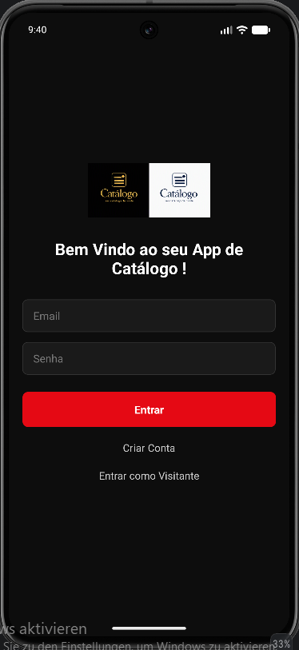

### Tela de cadastro

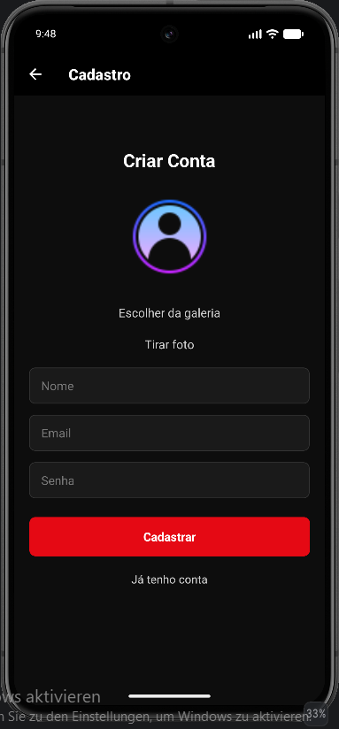

### Tela de home

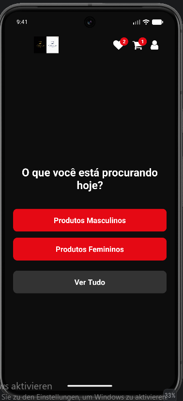

### Tela de produtos

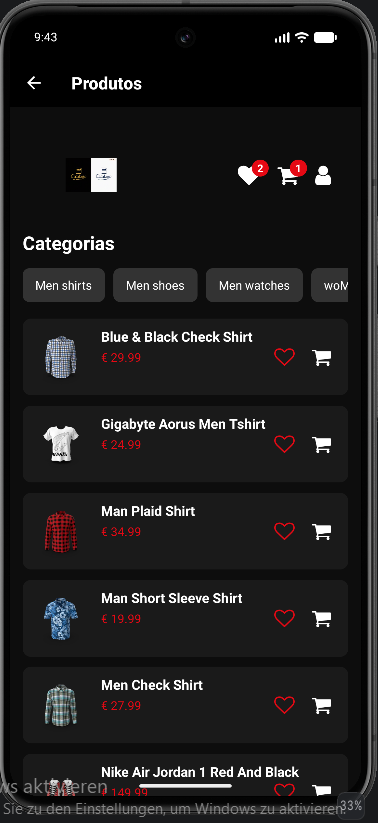

### Tela de produtos Femininos

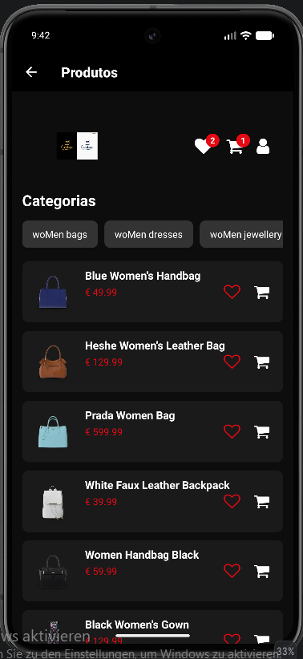

### Tela de produtos Masculinos

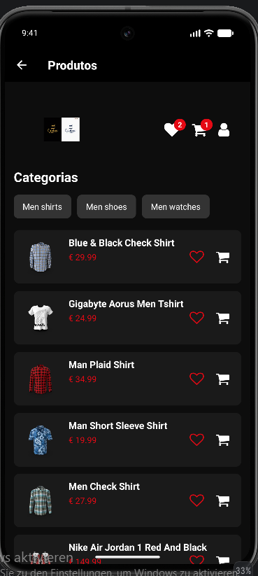

### Tela de detalhe do produto

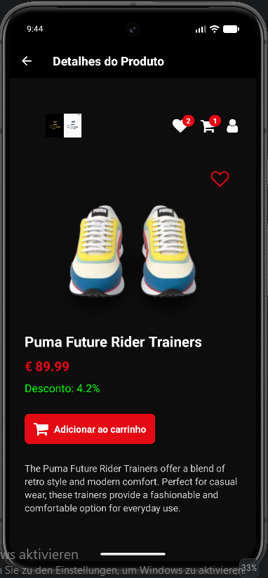

### Tela de favoritos

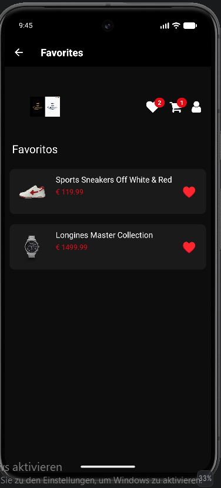

### Tela de carrinho

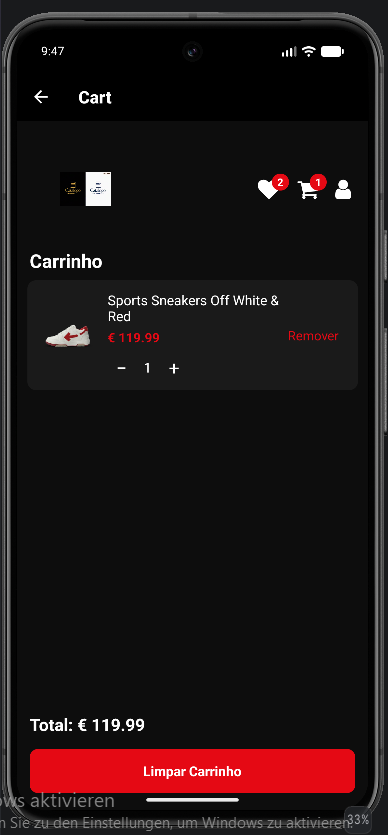

### Tela de editar usuario

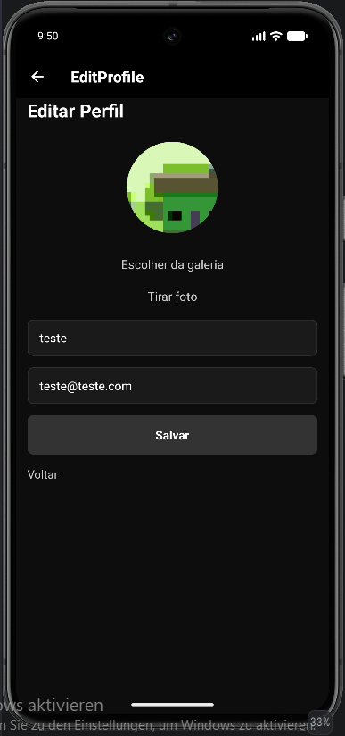

### Tela de perfil de visitante

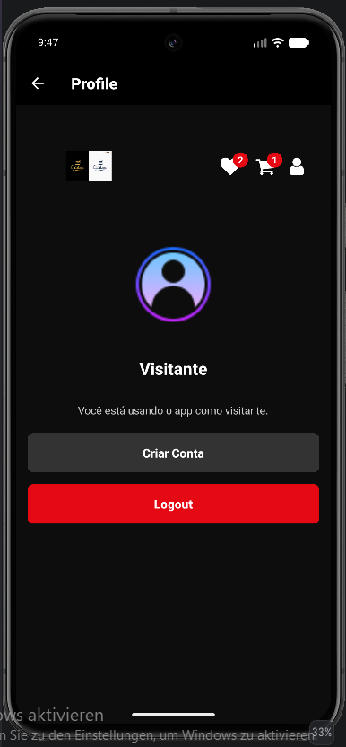

### Tela de perfil usuario

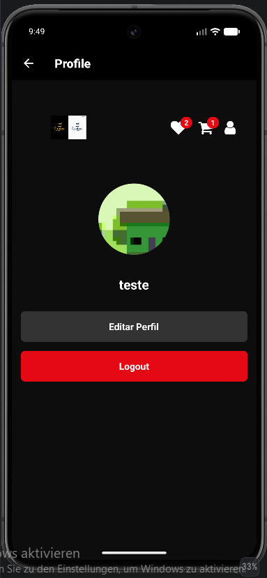

### Métricas

- Proposta: Prometheus + Grafana
- HPA baseado em CPU

### Tracing

- Proposta: OpenTelemetry + Jaeger

---

## Estrutura do projeto

assets/imagens
src/
  components/
  screens/
  navigation/
  store/
  hooks/
  database/
  utils/
  redux

---

## Observações

O projeto é voltado para aprendizado.

Redux Persist mantém o estado mesmo ao trocar de usuário.

Melhorias futuras podem incluir separação de estado por usuário, com validacoes extras para evitar falhas de seguranca